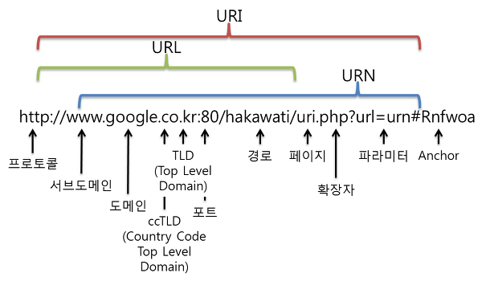

# URI, URL

- URI : URI는 특정 리소스를 식별하는 **통합 자원 식별자(Uniform Resource Identifier)**를 의미한다. 웹 기술에서 사용하는 논리적 또는 물리적 리소스를 식별하는 고유한 문자열 시퀀스다.
- URL : URL은 흔히 웹 **주소**라고도 하며, 컴퓨터 네트워크 상에서 리소스가 **어디 있는지 알려주기** 위한 규약이다. URI의 서브셋이다.

즉, URI는 정확한 주소를 가리키고, URL은 뒤에 부분을 생략한 주소를 가리킨다.(정확한 주소를 가리킬 수도 있다.) 그리고 이 생략된 부분은 웹에서 알아서 처리해서 URL을 입력해도 URI로 정확히 이동시켜준다.

### 참고문서

개인블로그, uri vs url : https://www.charlezz.com/?p=44767

개인블로그, 이미지 참조 :https://mwoo526.tistory.com/17

mozila 공식, url의 정의https://developer.mozilla.org/en-US/docs/Learn/Common_questions/What_is_a_URL