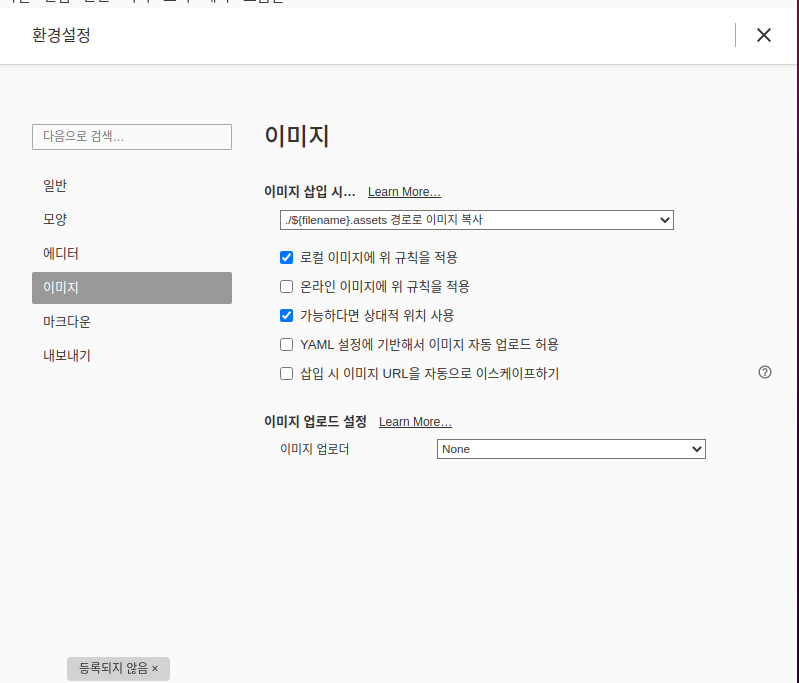

# typora 이미지 미 업로드 현상 해결법

---

- typora를 git에 올릴 때, 이미지가 git에서 제대로 보이지 않는 현상이 있다. 이를 해결하기 위해서는 몇 가지 방법이 있다.

1. 상대경로를 git에서 받아서 올리기
2. typora 설정을 변경하여 파일을 자동으로 생성하고 경로를 `img`로 감싸주기

이 중 나는 2번 방법을 선호한다.  파일명이 많아져서 더러워보이지만 신경쓸 것이 적기 때문이다. Typora 환경설정을 들어가서 아래 그림과 같이 설정을 바꿔주자. 이렇게 바꾼 후부터는 git에서 제대로 보이게된다.

### 2번 케이스

- 아래 사진과 같이 환경설정에 들어가서 이미지 삽입 시 "./$~~~~"경로로 이미지 복사로 바꿔주자
- 가능하다면 상대적 위치 사용을 체크해주자
- 그 후 이미지를 삽입하면 타이포라 식 상대적경로로 나오는데 이것을 img tag로 감싸주자

```
 
=>

```

 


- local에서는 두 사진 다 잘보이지만, git에서 아래 사진만 보일 것이다.